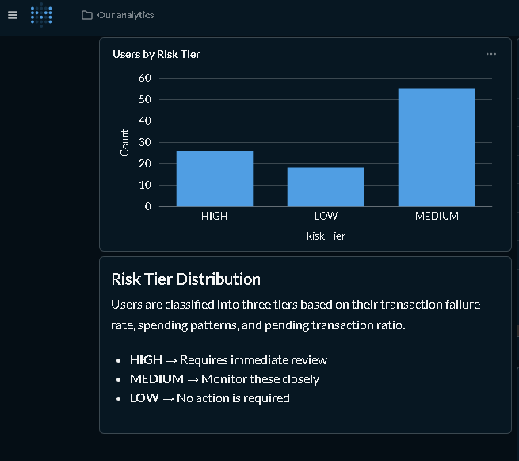
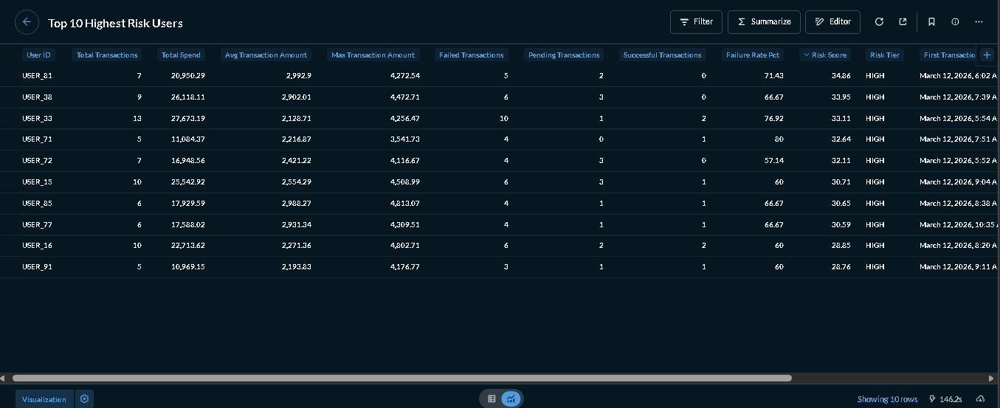
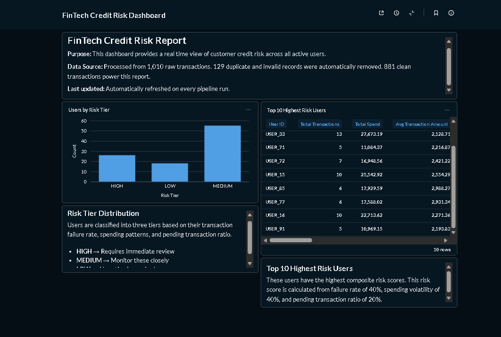

# The FinTech Credit Ledger

A production grade data pipeline built on the Modern Data Stack.

## Business Problem
A FinTech startup's backend system produces messy transaction of data full of 
duplicates, missing values, and invalid currencies. The CFO needs a trusted 
"Single Source of Truth" for credit risk reporting.

## Solution
A fully automated Medallion Architecture pipeline that transforms raw, 
untrusted data into a clean, tested, executive ready risk report.

## Tech Stack Used
| Tool | Purpose |
|---|---|
| Python | Data ingestion and simulation |
| Google BigQuery | Cloud data warehouse |
| dbt Core | Data transformation and testing |
| Docker + Metabase | Dashboard and visualization |
| GitHub Actions | CI/CD pipeline |

## Architecture
```
raw_transactions (Bronze)
       ↓
silver_transactions (Silver) —> deduped, cleaned, tested
       ↓
gold_user_risk_scores (Gold) —> risk scored, CFO and report ready
```

## Data Quality
- 11 automated tests across Silver and Gold layers
- Contract enforcement on critical columns
- Pipeline stops automatically if data quality degrades

## Results
| Layer | Rows | Description |
|---|---|---|
| Bronze | 1,010 | Raw, messy, untouched |
| Silver | 881 | Cleaned, deduplicated |
| Gold | 99 | One risk score per user |  

## Dashboard Preview

### Risk Tier Distribution


### Top 10 Highest Risk Users


### Dashboard 


## Business Impact
- Automatically flags HIGH risk users before the CFO sees bad data
- Eliminates 129 duplicate/invalid transactions from reporting (data cleaning is scalable)
- 11 automated data quality tests run on every pipeline execution
- Single Source of Truth for credit risk reporting